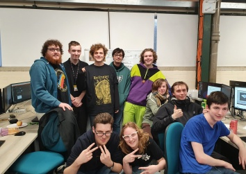

# BuildingBridges

## Description

RoySource's Building Bridges game for Global Game Jam 2020.

## Licensing

This work is licensed under a [Creative Commons Attribution-NonCommercial-ShareAlike 4.0 International License](http://creativecommons.org/licenses/by-nc-sa/4.0/)

## Information

- This project will be using Unity Version 2018.4.2f1
- We have a private server where this project was previously hosted.

### Team Members

|              Programmer               |           Artist            |           Designer           |     Writer     |             Audio              |
| ------------------------------------- | --------------------------- | ---------------------------- | -------------- | ------------------------------ |
| [Christopher Robertson](https://github.com/Koltonix) | [Tom Copp](https://www.artstation.com/thomascopp) | [Elise Dennis](https://github.com/Mistiare) | Andrew Shawley | [Tom Trathen](https://soundcloud.com/strawberrynooc) |
| [Morgan Penrose](https://github.com/PlayTheFallen)       | Kate Hookham                | Danielius Mileris            | Joesph Dunn    |                                |
|                                       | Daniel Truman               |                              |                |                                |

## Controls

- WASD - Movement
- Space - Pickup / Drop Object
- Q / E - Object Rotation (Left / Right)

## Links

- [Global Game Jam 2020 Page](https://globalgamejam.org/2020/games/building-bridges-8)
- [GitHub Repository](https://github.com/PlayTheFallen/BuildingBridges)

## Additional Notes

- The upload page for game jam stated that we should use CCv3 yet [the rules](https://globalgamejam.org/news/be-cool-rules) state CCv4. We do not know why this is the case, but hope it is resolved as soon as possible.
- We know of the issue with level 2 and plan to have this fixed in the [First Post Game Jam Release](https://github.com/PlayTheFallen/BuildingBridges/milestone/1).
